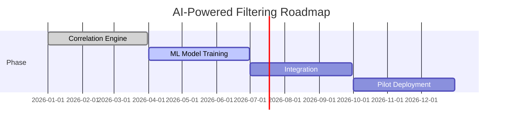

# Why Alarms?  

Alarm management is critical to security operations, but operators face unprecedented challenges.  
**Proof:**  
- 90–95% of alarms are false positives; operators handle 200–300 alerts/day; 40–50% of SOC cost is spent managing false alarms  
- 47% of end-users plan to use AI for event filtering (2025 survey)
---
## Component 1: AI-Powered Filtering

---
